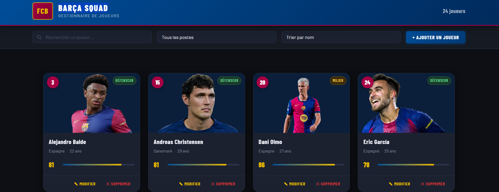
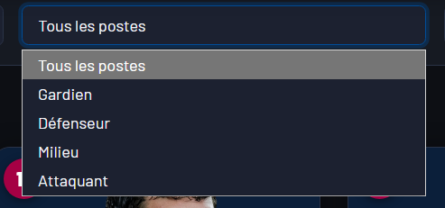
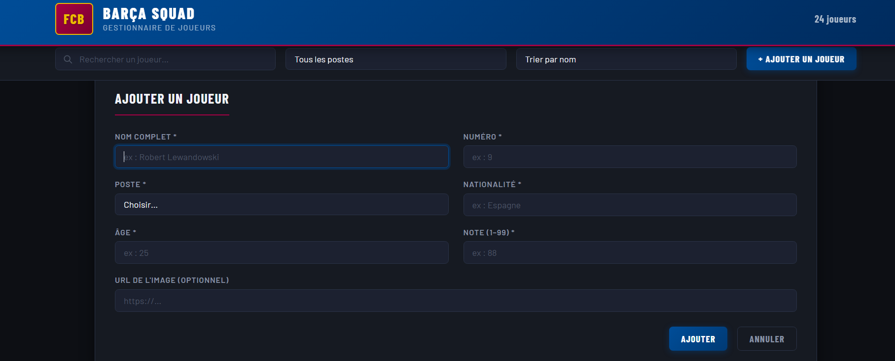
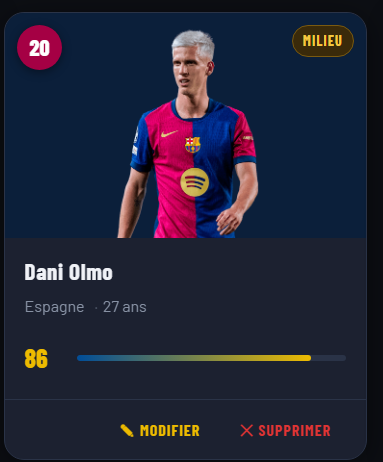

# Mon projet 122

Projet Javascript — Cours 122 (ESIG)

 Projet "Barça squad" 

## Description
Barça Squad est un projet personnel réalisé en HTML, CSS et JavaScript.  
Le site permet de visualiser et gérer l'effectif du FC Barcelone de manière interactive..
C'est un projet que me tient à cœur, car je suis un grand fan du club et j'ai voulu créer un site pour eux.

## Lien GitHub Pages

https://github.com/EndritRamusi2504/122-projet-perso-Endrit-Ramusi

## Fonctionnalités
Affichage dynamique de la liste des joueurs
-  Recherche en temps réel
-  Filtrage par poste
-  Tri par différents critères
-  Ajout d'un joueur via un formulaire
-  Modification d'un joueur existant
-  Suppression d'un joueur
-  Responsive design

## Captures d'écran
Apperçu du site

Filtre par poste

Ajout de joueur 

Structure d'un joueur, avec possibilité de le modifier ou de le supprimer, je lui ai ajouter une note pour le fun, son numéro de maillot et son poste.

## Transparence IA
J'ai utilisé Claude et ChatGPT tout au long de ce projet. Ces outils m'ont aidé lorsque je rencontrais des erreurs et des bugs, pour restructurer mon code, pour trouver et structurer mes idées, pour savoir comment démarrer certaines fonctionnalités et pour comprendre comment faire les choses que je ne savais pas encore faire. Je les ai utilisés de manière pédagogique : l'IA m'expliquait, je comprenais, et c'est moi qui appliquais ensuite. Je suis fier de cette façon de travailler car en 2026, savoir bien utiliser l'IA est une compétence de plus en plus demandée, et ce projet m'a permis de vraiment la développer.
Donc il y a l'aide de l'ia mais pas pour faire le travail à ma place, mais pour m'aider à progresser et à apprendre. Je voulais être transparent sur ce point, car je pense que c'est important de montrer comment j'ai utilisé l'IA de manière intelligente et réfléchie, plutôt que de prétendre que j'ai tout fait moi-même ou que l'IA a tout fait pour moi.
J'espere que cela se remarque car j'ai une peur par rapport au moment ou l'ia a juste restructurer mon code et m'a dit que c'était mieux de faire comme ça, j'avais peur que cela soit considéré comme de l'abus d'usage de l'ia, mais je pense que c'est une bonne utilisation de l'ia, car elle m'a aidé à comprendre les bonnes pratiques en JavaScript et à rendre mon code plus lisible et mieux organisé, ce qui est une compétence importante à développer en tant que développeur.

### Outils utilisés
J'ai utilisé deux outils d'IA tout au long du projet :

- Claude — principalement pour restructurer mon code, mieux organiser mes fichiers et comprendre les bonnes pratiques en JavaScript.
- ChatGPT — surtout pour déboguer les erreurs que je rencontrais et avoir des explications sur des concepts que je ne maîtrisais pas encore.
### Prompts utilisés
Voici quelques exemples de prompts que j'ai utilisés durant le projet ( bien sûr j'ai demandé a l'IA de reformuler les prompts pour les rendre plus clairs et précis car si je copier coller ce que j'avais écris même moi j'aurais du mal a comprendre ) :
 
Débogage :
"J'ai une erreur dans ma fonction d'affichage des joueurs. Voici mon code : [code]. Qu'est-ce qui ne va pas ?"
 
Restructuration du code :
"Restructure tout mon code et rends le lisible, reorganise le ?"

Aide à la compréhension :
"Comment faire une recherche en temps réel sur une liste d'objets en JavaScript ? Je veux filtrer les joueurs par nom au fur et à mesure que l'utilisateur tape."
 
Aide pour une fonctionnalité :
"Je veux permettre à l'utilisateur de modifier les informations d'un joueur déjà affiché dans la liste. Quelle est la meilleure approche en JavaScript vanilla ?"
 
Idées de fonctionnalités :
"Quelles fonctionnalités intéressantes pourrais-je ajouter à une application de gestion d'équipe de football en HTML/CSS/JS ?"

### Ce que j'ai appris vs ce que l'IA a généré

Ce que j'ai fait moi-même :  
J'ai conçu le projet de A à Z : la structure HTML, le design CSS, et l'ensemble de la logique JavaScript. Toutes les décisions créatives — le choix du thème FC Barcelone, les données à afficher par joueur (numéro, poste, note), l'organisation des fonctionnalités — viennent de moi.
Ce que l'IA a contribué :  
J'ai utilisé l'IA de façon pédagogique et réfléchie, pas pour qu'elle fasse le travail à ma place, mais pour m'aider à progresser. Concrètement, elle m'a aidé à :
Trouver et structurer mes idées — quand j'avais une vague idée de fonctionnalité, l'IA m'aidait à la clarifier et à définir par où commencer.
Démarrer les fonctionnalités complexes — lorsque je ne savais pas comment aborder quelque chose, elle m'expliquait la logique et les étapes à suivre, et c'est moi qui codais ensuite.
Corriger mes erreurs — face à des bugs ou des messages d'erreur, je lui soumettais mon code et elle m'expliquait ce qui n'allait pas et pourquoi.
Restructurer et améliorer mon code — elle m'a aidé à rendre mon code plus lisible, mieux organisé et plus maintenable.
Ce que j'ai appris :  
Je suis fier de la façon dont j'ai utilisé l'IA sur ce projet. Je ne l'ai pas utilisée comme une béquille pour tout générer, mais vraiment comme un outil pédagogique : elle m'expliquait, je comprenais, puis j'appliquais moi-même. Cela m'a permis de monter en compétences en JavaScript tout en apprenant à collaborer intelligemment avec l'IA. En 2026 et dans les années à venir, savoir utiliser l'IA de manière efficace et critique est une compétence de plus en plus recherchée — et je suis convaincu que ce projet m'a donné une vraie longueur d'avance sur ce plan.
